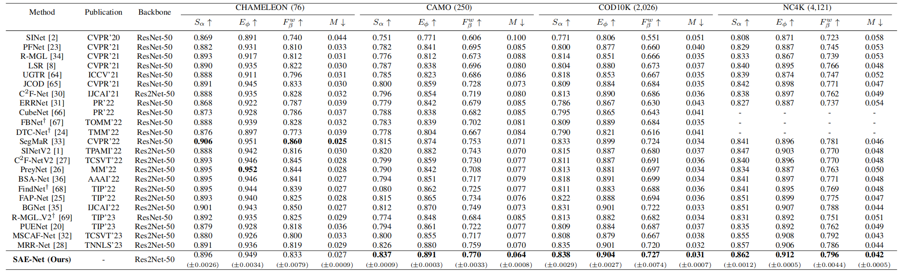

#  Weighted Dense Semantic Aggregation and Explicit Boundary Modeling for Camouflaged Object Detection (IEEE-JSEN 2024)

> **Authors:** 
> Weiyun Liang,
> Jiesheng Wu,
> Xinyue Mu,
> Fangwei Hao,
> Ji Du,
> Jing Xu,
> and Ping Li

## 1. Overview

- This repository provides code for "_** Weighted Dense Semantic Aggregation and Explicit Boundary Modeling for Camouflaged Object Detection**_", IEEE Sensors Journal, 2024. [Paper](https://ieeexplore.ieee.org/document/10537109) 

### 1.1. Introduction
 Camouflaged object detection in monocular images has garnered broad attention recently, aiming to segment objects that have high intrinsic similarity with their surroundings. Despite remarkable performance achieved by existing methods, two limitations persist: insufficient utilization of multi-level semantics at each decoding scale and a lack of “explicit” knowledge guidance in boundary learning, leading to performance drops in challenging scenarios. To address these issues, we propose a weighted dense semantic aggregation and explicit boundary modeling network (SAE-Net). Specifically, a weighted dense semantic aggregation module (WDSA) is proposed to sufficiently aggregate multi-level semantics at each decoding scale, and enable the exploration of the relationship between multi-level features and camouflaged objects. An explicit boundary modeling module (EBM) is developed to capture edge semantics with explicit boundary knowledge guidance and enhance the feature representation with edge cues. A detail enhanced multi-scale module (DEMS) is further designed to refine multi-scale features. Extensive experiments demonstrate that our proposed method achieves competitive performance against state-of-the-art methods on four benchmark datasets without excessive model complexity.

### 1.2. Framework

      
    <em> 
    Figure 1: (a) Overall architecture of our proposed SAE-Net. It consists of three main components, i.e., WDSA, DEMS, and EBM. (b) The simplified pipeline of WDSA. WDSA adaptively aggregates multi-level semantics to sufficiently integrate the global localization information of high-level features and the texture information of low-level features for each distinct decoding scale. (c) The simplified pipeline of EBM. The boundary features (Fboundary) learned though explicit boundary knowledge guidance contain strong edge priors compared to image features (F), making it easier to learn intact and continuous edges.
    </em>

### 1.3. Quantitative Results

      
    <em> 
    Figure 3: Quantitative Comparison of CNN-based COD Methods.
    </em>

      
    <em> 
    Figure 4: Quantitative Comparison of Transformer-based COD Methods.
    </em>

      
    <em> 
    Figure 5: Quantitative Comparison of SOD Methods.
    </em>

### 1.4. Qualitative Results

      
    <em> 
    Figure 6: Qualitative Comparison.
    </em>

## 2. Proposed Baseline

### 2.1. Prepare the Data

The training and testing datasets can be downloaded from https://github.com/GewelsJI/SINet-V2/tree/main .

You can modify `config.py` to set all the data paths. Here is an example of a setup:

1. Put the training data in folder `./data/COD/TrainDataset`, and put the testing data in folder `./data/COD/TestDataset`.

2. `TrainDataset` should contain two folders: `Imgs` and `GT`. 

3. `TestDataset` should contain four folders: `CHAMELEON`, `CAMO`, `COD10K`, and `NC4K`. Each of the four folders contains two sub-folders: `Imgs` and `GT`.

### 2.2 Training Configuration

+ Traning hyperparameters and data paths can be modified in `config.py`.

+ Installing necessary packages:
   + pytorch: https://pytorch.org
   + pysodmetrics: https://github.com/lartpang/PySODMetrics
  
### 2.3 Training, Inference, and Testing

+ Run `train.py` to train the model.

+ Run `inference.py` to generate the prediction maps. Set path to your trained checkpoint (`pth_path`).

+ Run `evaluate.py` to calculate the evaluation metrics for the prediction maps. Set path to your predictions (`pred_path`).

## 3. Pre-computed Maps

+ COD Pre-computed Maps: 
   + SAE-Net (Res2Net-50): [Google Drive](https://drive.google.com/file/d/1veIaSU49TXnZxSKkex-WrSIH5WZHFUJU/view?usp=sharing) or [Baidu Drive](https://pan.baidu.com/s/1xAaj6vMtRba4N1KIdSHQ6w) (extraction code: slou)
   + SAE-Net (PVTv2): [Google Drive](https://drive.google.com/file/d/1yRKRh6cN5gQr8Rkq4_dG5JcEyTzhsAKp/view?usp=sharing) or [Baidu Drive](https://pan.baidu.com/s/1Zxb8nSv7QAD1QX4aTR6Gfw) (extraction code: 8v0n)

+ SOD Pre-computed Maps:
   + SAE-Net (Res2Net-50): [Google Drive](https://drive.google.com/file/d/1iTUphJXr8sHZEWWvKR2Z_jMYU0_yy4wu/view?usp=sharing) or [Baidu Drive](https://pan.baidu.com/s/1g_Lr21oqPXwh5_wLQrBZyw) (extraction code: sdpt)

## 4. Citation

Please cite our paper if you find the work useful, thanks!
	
    @ARTICLE{10537109,
      author={Liang, Weiyun and Wu, Jiesheng and Mu, Xinyue and Hao, Fangwei and Du, Ji and Xu, Jing and Li, Ping},
      journal={IEEE Sensors Journal}, 
      title={Weighted Dense Semantic Aggregation and Explicit Boundary Modeling for Camouflaged Object Detection}, 
      year={2024},
      volume={},
      number={},
      pages={1-1}, 
      doi={10.1109/JSEN.2024.3401722}
    }

    
**[⬆ back to top](#1-overview)**
